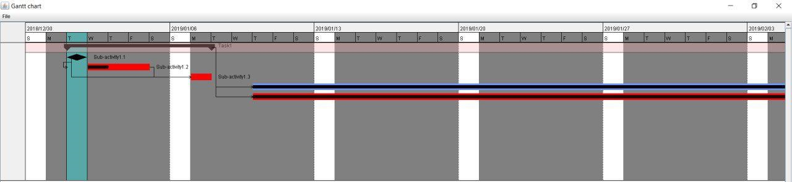
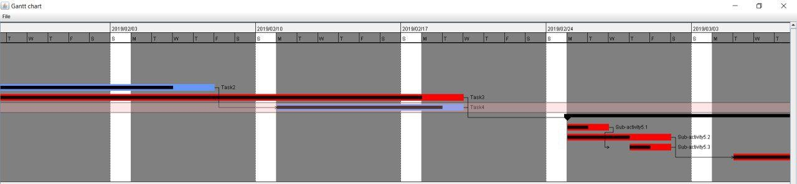

# Gantt-chart
A Gantt chart is a type of bar chart that illustrates a project schedule. This chart lists the tasks to
be performed on the vertical axis, and time intervals on the horizontal axis. The width of the
horizontal bars in the graph shows the duration of each activity. Gantt charts illustrate the start and
finish dates of the terminal elements and summary elements of a project. Terminal elements and
summary elements constitute the work breakdown structure of the project

## Team
- Kostia Synytsia - kostiantyn.synytsia@gmail.com
- Sviatoslav Konstantyniv - svyatopato@gmail.com
- Anton Vovk - archwolf@protonmail.com
- Vladislav Manzhula - jay.k0lad@gmail.com

## Task includes:
Implement a JAVA program to read Gantt chart from XML file, present in graphical form and determine the critical path.
- Design of XML structure;
- Implement loading data from XML structure;
- Present in graphical form considering dependences between task
- Determine and present critical path

## Assumptions of task:
- At least 2 parallel paths of project
- Static presentation of WBS
- Presentation of references between tasks
- Technology requirenments:
  - Java 8
  - Maven/Gradle build automation tool
  - JUnit for unit testsing is a plus

## What does the application do
The application reads an XML file which contains tasks then validates it using XSD. 
If validation is successful, the application will parse the file into our classes. 
After the data was parsed, it is checked for correction(dependencies, dates, e.c.)
Finally, it is displayed on the screen.

## XML input instruction
To see how to set XML file see [XML examples](docs/ExamplesXML.md)

## Screenshots

